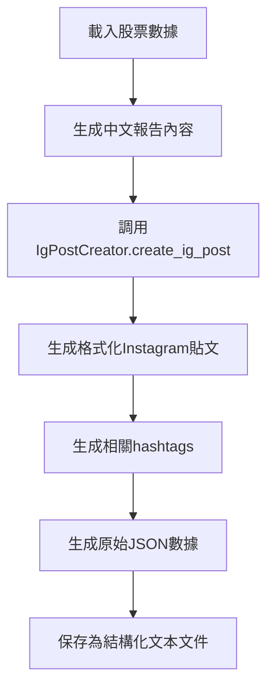

# 📱 Instagram Post 格式說明

## 🎯 IG Post 生成流程

### **與Streamlit應用完全一致的流程**



## 📄 文件格式詳解

### **文件命名**
```
{SYMBOL}_ig_post_{YYYY-MM-DD}.txt
```
例如：`AAPL_ig_post_2025-01-27.txt`

### **文件內容結構**

```
=== INSTAGRAM POST ===

📊 AAPL Quick Update (2025/01/27)

✅ Bullish Highlights

• Strong revenue growth of 147% YoY to $8.4M in Q2
• Secured a $10M multi-year e-Boost contract with major US EV charging provider
• Maintained FY2025 revenue guidance of $27-29M
• Strong cash position of $18M with no bank debt

⚠️ Key Risks

• Q2 operating loss of $1.7M despite revenue growth
• Gross margin decreased from 18.9% to 15.7%
• Cash reserves decreased from $41.6M to $18M

💡 Trading View

Bias: Bullish
The company shows strong growth trajectory with strategic partnerships in the expanding EV charging market.

📌 Short-Term Catalysts

• Continued expansion in EV charging infrastructure
• Potential for additional strategic partnerships

⚠️ DISCLAIMER: This is NOT financial advice. All information is for educational purposes only. Always do your own research and consult with a qualified financial advisor before making investment decisions. Past performance does not guarantee future results.


=== HASHTAGS ===

#stockmarket #growthstocks #daytrading #swingtrading #stockupdate #tradingtips #investors #financialnews #stockanalysis #traders #shortselling #aapl

=== RAW JSON ===

{
  "title": "AAPL Quick Update (2025/01/27)",
  "bullish_highlights": [
    "Strong revenue growth of 147% YoY to $8.4M in Q2",
    "Secured a $10M multi-year e-Boost contract with major US EV charging provider",
    "Maintained FY2025 revenue guidance of $27-29M"
  ],
  "key_risks": [
    "Q2 operating loss of $1.7M despite revenue growth",
    "Gross margin decreased from 18.9% to 15.7%",
    "Cash reserves decreased from $41.6M to $18M"
  ],
  "trading_view": {
    "bias": "Bullish",
    "suggestion": "The company shows strong growth trajectory with strategic partnerships"
  },
  "catalysts": [
    "Continued expansion in EV charging infrastructure",
    "Potential for additional strategic partnerships"
  ]
}
```

## 🔧 技術實現

### **自動化Worker中的實現**

```python
def generate_ig_post(self, symbol: str) -> Dict:
    # 1. 載入股票數據
    data = self.report_generator.load_stock_data(symbol)
    
    # 2. 生成中文報告內容作為基礎（與Streamlit一致）
    report_content = self.report_generator.generate_chinese_report_content(symbol, data)
    
    # 3. 使用IgPostCreator生成Instagram貼文
    ig_result = self.ig_creator.create_ig_post(symbol, report_content)
    
    # 4. 保存為與Streamlit一致的格式
    filename = self.save_ig_post_streamlit_style(symbol, ig_result)
```

### **保存格式（與Streamlit完全一致）**

```python
def save_ig_post_streamlit_style(self, symbol: str, ig_result: dict) -> str:
    # 使用相同的路徑結構
    filename = data_path / f"{symbol}_ig_post_{today_str}.txt"
    
    # 使用相同的文件格式
    with open(filename, 'w', encoding='utf-8') as f:
        f.write("=== INSTAGRAM POST ===\n\n")
        f.write(ig_result['formatted_post'])
        f.write(f"\n\n=== HASHTAGS ===\n\n")
        f.write(ig_result['hashtags'])
        f.write(f"\n\n=== RAW JSON ===\n\n")
        f.write(json.dumps(ig_result['raw_json'], ensure_ascii=False, indent=2))
```

## 📊 Streamlit中的顯示

### **自動檢測邏輯**

```python
# Streamlit會自動檢查IG post文件是否存在
ig_post_data = app.load_ig_post(symbol)

if ig_post_data.get("exists"):
    # 顯示現有的IG貼文
    st.success("✅ 發現現有 Instagram 貼文")
    
    # 分標籤頁顯示內容
    ig_tab1, ig_tab2 = st.tabs(["📱 Instagram 貼文", "🏷️ Hashtags"])
```

### **文件解析邏輯**

```python
def load_ig_post(self, symbol: str) -> dict:
    # 解析文件內容
    sections = content.split("=== ")
    
    for section in sections:
        if section.startswith("INSTAGRAM POST ==="):
            ig_post = section.replace("INSTAGRAM POST ===\n\n", "").split("\n\n=== ")[0]
        elif section.startswith("HASHTAGS ==="):
            hashtags = section.replace("HASHTAGS ===\n\n", "").split("\n\n=== ")[0]
        elif section.startswith("RAW JSON ==="):
            json_text = section.replace("RAW JSON ===\n\n", "")
            raw_json = json.loads(json_text)
```

## 🎨 內容生成邏輯

### **IgPostCreator工作流程**

1. **分析報告內容**: 基於中文報告內容
2. **提取關鍵信息**: 
   - 利好因素 (bullish_highlights)
   - 風險因素 (key_risks)  
   - 交易觀點 (trading_view)
   - 催化劑 (catalysts)
3. **生成格式化貼文**: Instagram友好的格式
4. **生成hashtags**: 相關的投資和股票標籤
5. **保存原始JSON**: 供程序化使用

### **內容來源**

- **基於中文報告**: 使用 `generate_chinese_report_content()` 的輸出
- **AI處理**: ChatGPT分析報告內容生成Instagram格式
- **一致性**: 與Streamlit手動生成的內容完全一致

## ✅ 完美整合

### **自動化Worker的優勢**

1. **完全自動**: 無需手動點擊「生成IG貼文」按鈕
2. **即時可見**: 打開Streamlit立即看到已生成的貼文
3. **格式一致**: 與手動生成的格式完全相同
4. **內容質量**: 使用相同的AI邏輯和提示詞

### **使用體驗**

1. ✅ **背景生成**: Worker自動為新symbols生成IG貼文
2. ✅ **Streamlit檢測**: 打開應用自動顯示已存在的貼文
3. ✅ **無縫操作**: 可以直接下載或查看已生成的內容
4. ✅ **格式完美**: 三個部分清晰分離，便於使用

**完美的自動化IG貼文生成體驗！** 🚀📱
