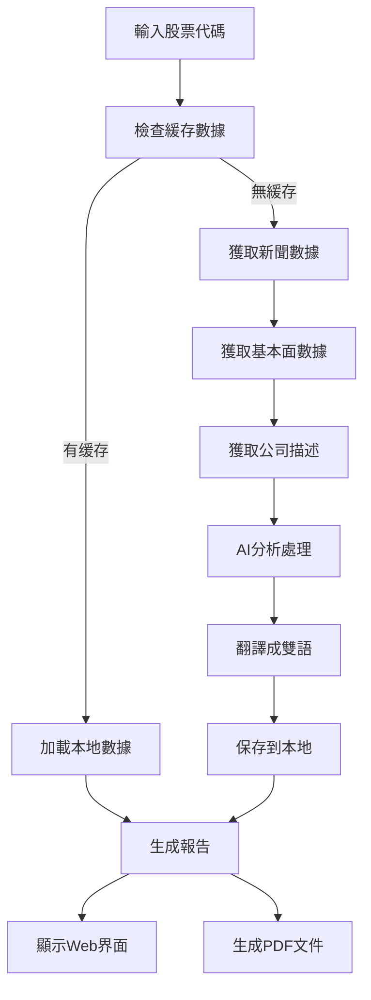

# 📊 股票分析報告生成器

一個基於AI的全自動股票分析系統，支持中英文雙語報告生成，提供專業的PDF和Markdown格式輸出。

## ✨ 功能特色

### 🎯 核心功能
- **多數據源整合**: 自動獲取新聞、基本面數據和公司描述
- **AI智能分析**: 使用ChatGPT和DeepSeek進行深度分析
- **雙語支持**: 完整的中英文報告生成
- **多格式輸出**: 支持Markdown和PDF格式
- **Web界面**: 現代化的Streamlit Web應用
- **智能緩存**: 避免重複API調用，提高效率

### 📋 分析內容
- **📰 新聞分析**: 自動翻譯和總結最新新聞
- **📊 基本面分析**: 
  - 利好因素識別
  - 風險因素評估
  - 流動性分析
  - 投資建議
- **🏢 公司描述**: 從Yahoo Finance獲取並翻譯
- **💡 投資建議**: AI生成的專業投資建議

### 🎨 報告特色
- **美觀表格**: 專業的表格樣式設計
- **顏色編碼**: 投資建議用顏色區分（看多/看空/中性）
- **響應式設計**: 適配不同屏幕尺寸
- **PDF優化**: 完美的中英文PDF生成

## 🚀 快速開始

### 方式一：Docker部署（推薦）
```bash
# 克隆項目
git clone <your-repo-url>
cd news_steamlit

# 一鍵啟動
./start.sh

# 訪問應用
open http://localhost:8501
```

### 方式二：本地運行
```bash
# 安裝依賴
pip install -r requirements.txt

# 啟動應用
streamlit run run_streamlit.py
```

## 📋 系統要求

### 最低配置
- **內存**: 512MB RAM
- **CPU**: 1核心
- **存儲**: 2GB可用空間
- **網絡**: 穩定的互聯網連接

### 推薦配置
- **內存**: 2GB RAM
- **CPU**: 2核心
- **存儲**: 5GB可用空間

## 🔧 配置說明

### API密鑰設置
在`config.py`中配置您的API密鑰：

```python
# OpenAI API配置
OPENAI_API_KEY = "your_openai_api_key"

# DeepSeek API配置
DEEPSEEK_API_KEY = "your_deepseek_api_key"

# MongoDB配置（可選）
MONGODB_URI = "your_mongodb_connection_string"
```

### 環境變數
您也可以使用環境變數：
```bash
export OPENAI_API_KEY="your_key"
export DEEPSEEK_API_KEY="your_key"
export MONGODB_URI="your_uri"
```

## 📖 使用指南

### 1. 輸入股票代碼
- 支持單個股票：`AAPL`
- 支持多個股票：`AAPL, TSLA, MSFT`
- 自動清理格式和去重

### 2. 生成報告
- 系統自動檢測缺失數據
- 顯示實時進度和狀態
- 智能緩存避免重複處理

### 3. 查看結果
- **中文報告標籤頁**: 完整的中文分析
- **英文報告標籤頁**: 完整的英文分析
- **下載選項**: PDF和Markdown格式

### 4. 管理數據
- 自動按日期和股票代碼組織文件
- 支持強制刷新重新生成
- 完整的數據驗證機制

## 📁 文件結構

```
news_steamlit/
├── 📄 應用核心
│   ├── run_streamlit.py      # Streamlit Web應用
│   ├── run.py               # 數據處理主程序
│   ├── process_stock.py     # 股票處理邏輯
│   └── config.py           # 配置文件
├── 🔌 數據獲取
│   ├── get_news.py         # 新聞API
│   ├── get_company_desc.py # 公司描述爬蟲
│   └── mongo_db.py         # 數據庫操作
├── 🤖 AI模組
│   ├── llms_chatgpt.py     # ChatGPT集成
│   └── llms_deepseek.py    # DeepSeek集成
├── 💾 數據管理
│   ├── file_manager.py     # 文件管理系統
│   └── data/              # 數據存儲目錄
├── 🐳 Docker部署
│   ├── Dockerfile         # Docker鏡像配置
│   ├── docker-compose.yml # Docker Compose配置
│   └── start.sh          # 啟動腳本
└── 📚 文檔
    ├── README.md
    ├── docker_installation.md
    └── docker_usage.md
```

## 🔧 技術棧

### 後端技術
- **Python 3.11**: 核心開發語言
- **Streamlit**: Web應用框架
- **MongoDB**: 數據存儲（可選）
- **Requests**: HTTP客戶端
- **BeautifulSoup**: 網頁解析

### AI集成
- **OpenAI GPT**: 智能分析和翻譯
- **DeepSeek**: 結構化數據生成
- **JSON輸出**: 確保數據格式正確

### PDF生成
- **pdfkit**: HTML到PDF轉換
- **wkhtmltopdf**: PDF渲染引擎
- **reportlab**: 程序化PDF生成（備用）

### 部署技術
- **Docker**: 容器化部署
- **Docker Compose**: 服務編排
- **TrueNAS Scale**: NAS系統支持

## 🎨 UI特色

### 現代化界面
- **深色主題**: 專業的深色配色方案
- **響應式表格**: 自適應屏幕尺寸
- **實時進度**: 顯示處理進度和狀態
- **標籤頁設計**: 中英文內容分離

### 視覺效果
- **顏色編碼**: 
  - 🟢 利好/看多 (綠色)
  - 🔴 風險/看空 (紅色) 
  - 🟡 中性 (黃色)
- **圖標系統**: 豐富的emoji和圖標
- **表格美化**: 漸變背景和懸停效果

## 📊 數據流程



## 🔒 安全特性

- **API密鑰保護**: 敏感信息環境變數存儲
- **輸入驗證**: 嚴格的用戶輸入檢查
- **錯誤處理**: 完善的異常處理機制
- **非root運行**: Docker容器非特權運行

## 🚀 性能優化

- **智能緩存**: 避免重複API調用
- **並發處理**: 支持多股票並行分析
- **資源限制**: Docker資源配額管理
- **健康檢查**: 自動故障檢測和恢復

## 🛠️ 故障排除

### 常見問題

#### 1. PDF生成失敗
```bash
# 檢查wkhtmltopdf安裝
wkhtmltopdf --version

# Docker環境會自動安裝
```

#### 2. API調用失敗
```bash
# 檢查API密鑰配置
echo $OPENAI_API_KEY
echo $DEEPSEEK_API_KEY
```

#### 3. 字體顯示問題
```bash
# Docker會自動安裝中文字體
# 本地運行可能需要安裝字體包
```

### 日誌查看
```bash
# Docker環境
docker logs -f stock-analyzer

# 本地運行
# 查看Streamlit輸出
```

## 📈 更新日誌

### v2.0.0 (2025-01-15)
- ✨ 添加Docker部署支持
- 🎨 完全重構UI界面
- 🐛 修復PDF生成問題
- 🌏 完善雙語支持
- 📊 優化表格顯示

### v1.5.0 (2025-01-10)
- ✨ 添加公司描述功能
- 🎨 美化表格樣式
- 🐛 修復emoji顯示問題

## 🤝 貢獻指南

歡迎提交Issue和Pull Request！

1. Fork 本項目
2. 創建feature分支
3. 提交更改
4. 創建Pull Request

## 📄 許可證

本項目採用 MIT 許可證 - 查看 [LICENSE](LICENSE) 文件了解詳情。

## 🙏 致謝

- [Streamlit](https://streamlit.io/) - 優秀的Web應用框架
- [OpenAI](https://openai.com/) - 強大的AI能力
- [DeepSeek](https://www.deepseek.com/) - 專業的AI分析
- 所有開源項目貢獻者

## 📞 支持

如有問題，請：
1. 查看文檔：[docker_installation.md](docker_installation.md)
2. 查看使用指南：[docker_usage.md](docker_usage.md)  
3. 提交Issue到GitHub
4. 聯繫開發團隊

---

<div align="center">
  <strong>📊 讓AI為您的投資決策提供智能支持！ 🚀</strong>
</div>
